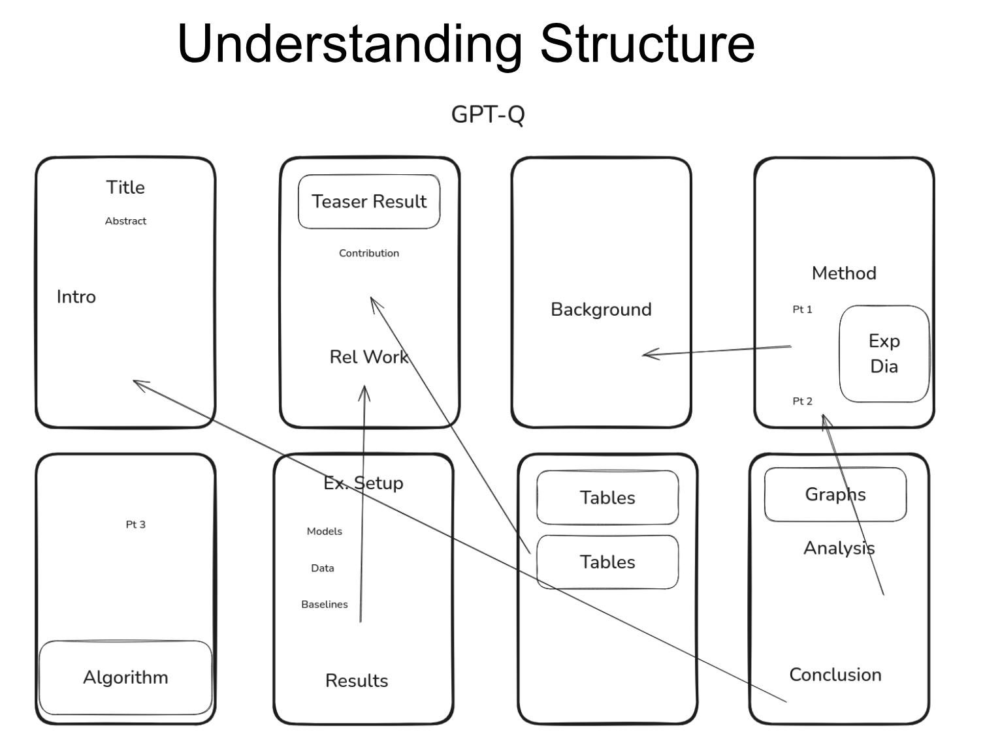
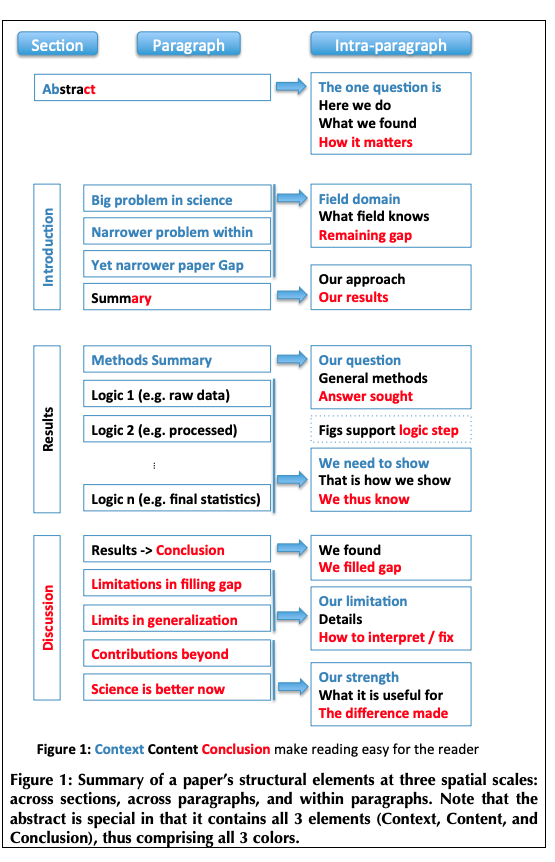
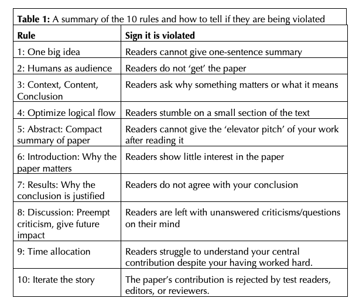

# LaTeX Template for Empirical ML Papers

This repository contains a LaTeX template for empirical machine learning papers.
The repo is set up so that you can focus on writing the content of your paper, rather than worrying about formatting.
We also provide some opinionated guidelines for how to structure and conceptualise your paper: each section .tex file has comments on what to include.

This template should help you effectively and efficiently achieve narrative structure, clarity and coherence.
Ideally you'd also like your paper to be beautiful, creative, empirically/theoretically groundbreaking and containing elegant rhetorical flourishes.
We will not necessarily help with those last points and occasionally for very creative works, you might want to break some of the guidelines we suggest.
Being mentored by a great researcher is probably the best way to learn how to write beautiful papers.

## Usage

This project is a template so you can use it to start your own paper with GitHub's template feature.

## To Watch

I very much recommend watching [this video](https://www.youtube.com/watch?v=qNlwVGxkG7Q) before you start writing your paper and [this video](https://www.youtube.com/watch?v=a1zDuOPkMSw&pp=ygUVeW91IGFuZCB5b3VyIHJlc2VhcmNo) before you choose your research topic.
I love [this video](https://www.youtube.com/watch?v=vtIzMaLkCaM&pp=ygUTd3JpdGluZyBlZmZlY3RpdmVseQ%3D%3D) for general writing advice.
You should also try and read (and review) as many papers in your subfield as is helpful to get a sense of what works and what doesn't.

## Tips for the Writing Process

Your paper should have ONE CORE IDEA.
It can have 2-4 contributions which all serve that one main idea.
If there are actually two ideas, make it two papers.

I recommend using git as source control and GitHub's UI for managing section updates in the initial stages of your project when you're drafting sections.
Once you're in the final edit, Overleaf is a great tool for collaborative editing and sharing with co-authors.

The first draft isn't the last draft, a few rounds of editing (with beta-readers and co-authors) will make your paper much stronger.

You should draft your Abstraction and Introduction before while or before doing your research.
This will helps focus the experiments and analysis on the key story of the work.
Writing papers is an integral part of the research process, not just a way to communicate the results after the fact.
Writing the intro forces you to be clear and focused, to see what you don't understand/can't motivate immediately and opens the dialogue with collaborators who you may not have whiteboarded with.

Before you start writing, it's worth having a rough notes file with all the things that you want to say and experiments that you want to run.
Much of this will probably make it into the first draft.
In general outlining saves much time in the long run - having a P1, P2 --> C style argument written down in your first draft is typically useful.

Paper Timeline:

1. Collect some notes on the idea and start talking with collaborators
2. Do some initial validating experiments
3. Write the abstract and introduction and share these with collaborators
4. Write out a paper outline with collaborators (a whiteboard session is best for this). You can use `notes/outline.md` to host this.
5. Complete experiments whilst drafting the paper using the GitHub UI
6. Do at least one round of edits for each section with the context of the rest of the paper
7. Share with beta-readers for feedback and do another round of edits
8. Finalise figures, appendices, final edits, LaTeX formatting etc. in Overleaf. Print out the paper and read it aloud to yourself to catch any awkward phrasing.

It's often worth making a structure diagram (cf Sasha Rush/Michael Dean) when you have a first draft.

## Structure

See `notes/parts_of_paper.md` for a detailed breakdown of the parts of a paper and where to focus your time.

## General Writing Advice

Regular writing advice applies: keep sentences short, use active voice, avoid jargon, use simple words, use the same word for the same concept, parallelism across sentence/section structures makes things easier to read, cite generously, when you're sharing an opinion make it clear that it's speculation.
Write drunk, edit sober.
Ensure that there are no "this", "that", "these" where it's not clear what "this" refers to (the "naked this").

Remember that conferences typically have an 8 page limit, fewer for workshops. This is a blessing for you - you will need to be concise. Economise your words accordingly, use the appendix for non-critical details. Simplify, always simplify.

## Checklist

Here's a checklist of checks before you submit your paper to a conference, workshop or journal:

- [ ] **Beta Readers**: Have you had at least 3 people read the paper and give feedback (ideally one senior person?). Fewer beta-readers may be acceptable if you have active co-authors. You should tell your beta-readers to be as critical as possible: Reviewer 2 will care less about your feelings so better to get the feedback now.
- [ ] **Abstract**: Does the abstract clearly state the problem, the approach, the results and the implications of the work? Rewrite the abstract from memory, ask a friend to rewrite your abstract, ask Claude to write an abstract from your paper. Compare all 4 versions and take the best bits from each.
- [ ] **Sharing**: Do you have a plan for how you're going to share the work with the community? LessWrong? Twitter? Slack channels?
- [ ] **Amy Tabb's Checklist**: [here](https://amytabb.com/tips/2019/05/09/basic-paper-submission-checklist/)

## Acknowledgements

The advice here is based on the following resources:

- 🌟 [How To Write An Okay Research Paper - Sasha Rush](https://docs.google.com/presentation/d/1LQFVB4MiAApFh4nlksn7Z5GY1pNx07yqkZ9SSsTfa8o/pub?start=false&loop=false&delayms=60000&slide=id.g2f3dfc92f64_0_41)
- 🌟 [How To Write A Great Research Paper - Simon Peyton Jones](https://simon.peytonjones.org/great-research-paper/)
- [Writing Beautifully in LaTeX - Adam Gleave](https://www.gleave.me/post/latex-design-patterns/)
- [Paper Writing - Jennifer Widom](https://cs.stanford.edu/people/widom/paper-writing.html)
- [A Survival Guide to a PhD - Andrej Karpathy](https://karpathy.github.io/2016/09/07/phd/)
- [Advice for Authors - Jacob Steinhardt](https://bounded-regret.ghost.io/advice-for-authors/)
- [Heuristics for Scientific Writing - Zachary C. Lipton](https://www.approximatelycorrect.com/2018/01/29/heuristics-technical-scientific-writing-machine-learning-perspective/)
- [Paper Template - Alex Loftus](https://github.com/loftusa/paper_template)
- [Scientific Writing Tips - Amy Tabb](https://amytabb.com/tips/2019/12/04/listicle-scientist-tips/)
- Paper Writing Session from Gavin Leach (no link)
- [Responding to Peer Review - Matt Might](https://matt.might.net/articles/peer-review-rebuttals/)
- [LaTeX math tips - Amy Tabb](https://amytabb.com/tips/2022/02/15/latex-math-i-newly-learned/)
- [Ten simple rules for structuring papers - Mensh and Kording](https://www.biorxiv.org/content/10.1101/088278v5.full.pdf)
- [How To ML Paper - Jakob Foerster](https://www.jakobfoerster.com/how-to-ml-paper)
- [Writing Tips for PhD Students - John Cochrane](https://static1.squarespace.com/static/5e6033a4ea02d801f37e15bb/t/5f62a398731cc06411b39f48/1600299928487/phd_paper_writing.pdf)
- [Small Guide To Making Nice Tables - Markus Püschel](https://people.inf.ethz.ch/markusp/teaching/guides/guide-tables.pdf)

I'm also inspired by my wonderful co-authors Lee Sharkey, Michael Pearce, Evžen Wybitul and Joseph Miller as well as the many other people who have given me feedback on my writing.
I'm also grateful for the non-technical writing advice I've received from Darren Frost, Anna Archakova, David Perell and others.

## Reference Papers

Some reference papers to look at for inspiration include:

- [OpenAI's SAEs](https://cdn.openai.com/papers/sparse-autoencoders.pdf)
- [Jump-ReLU SAEs](https://arxiv.org/pdf/2407.14435)
- [GPT-Q](https://arxiv.org/pdf/2210.17323)
- [vec2text](https://arxiv.org/pdf/2310.06816)

## Contributions

I'm always on the lookout for ways to improve this template, both with formatting and advice on technical writing.
If you have any suggestions, feel free to open an issue or a pull request.
I'd also love any links to either well-written papers or resources on technical writing that you'd recommend.
